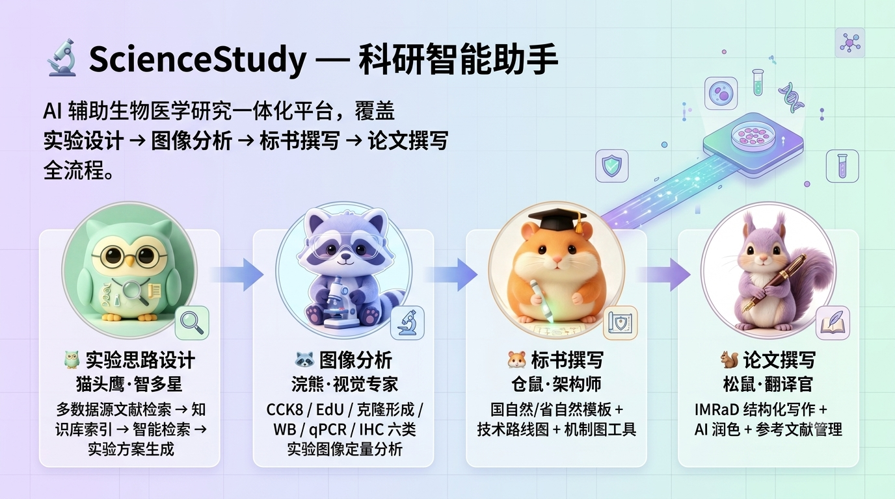
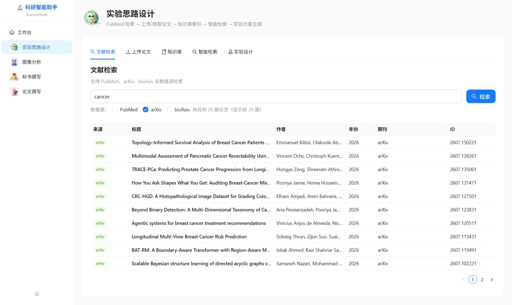
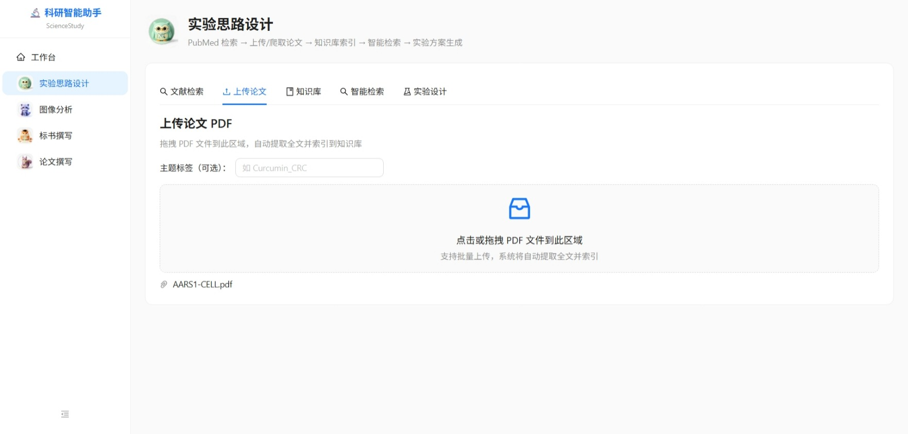
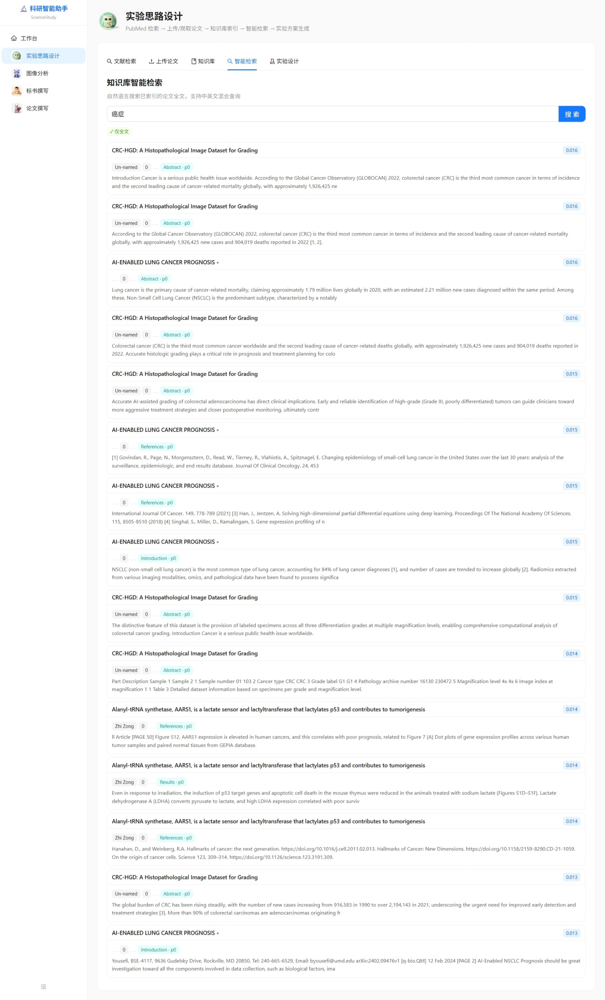
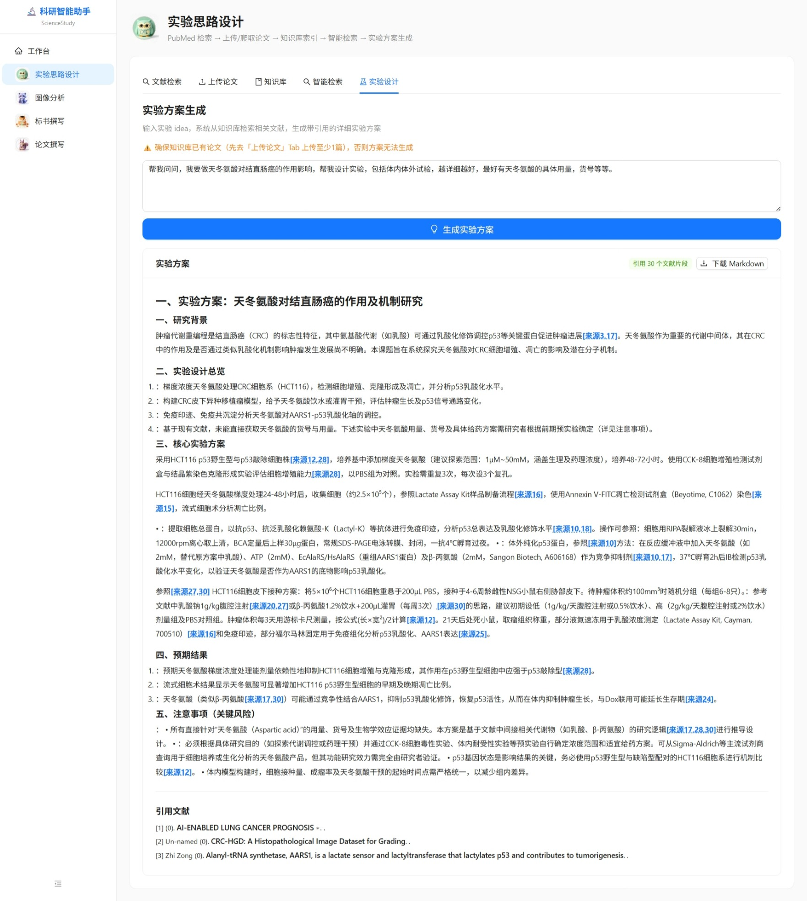
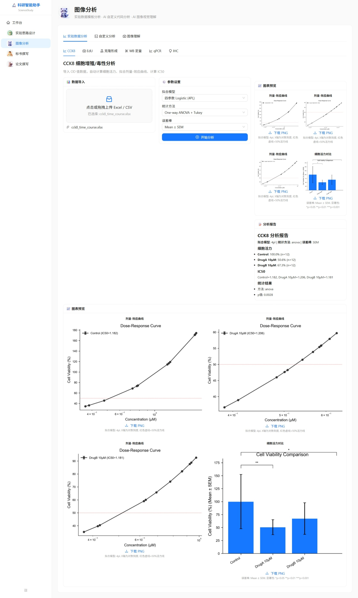
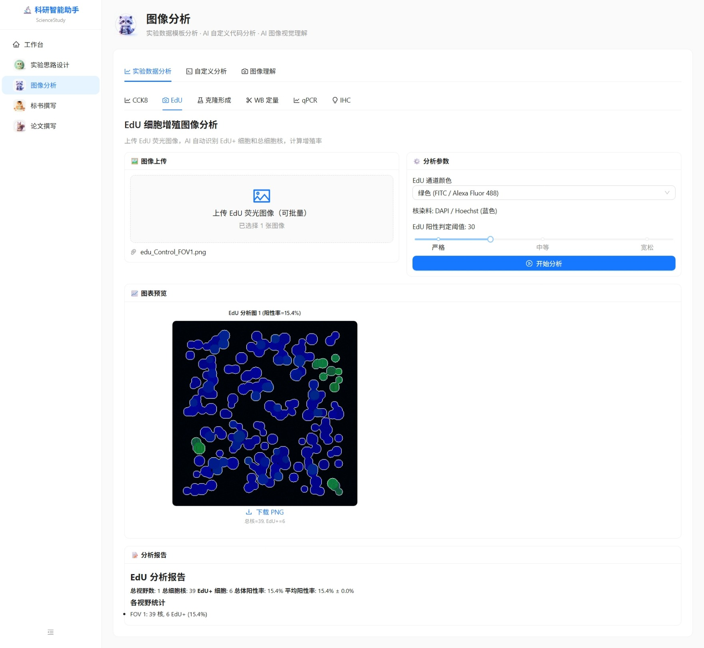
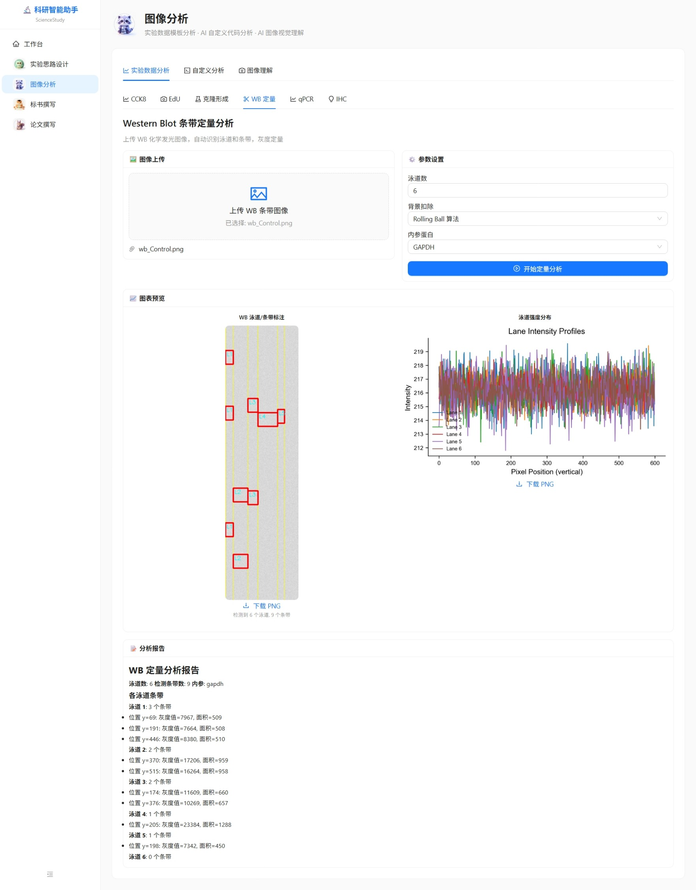
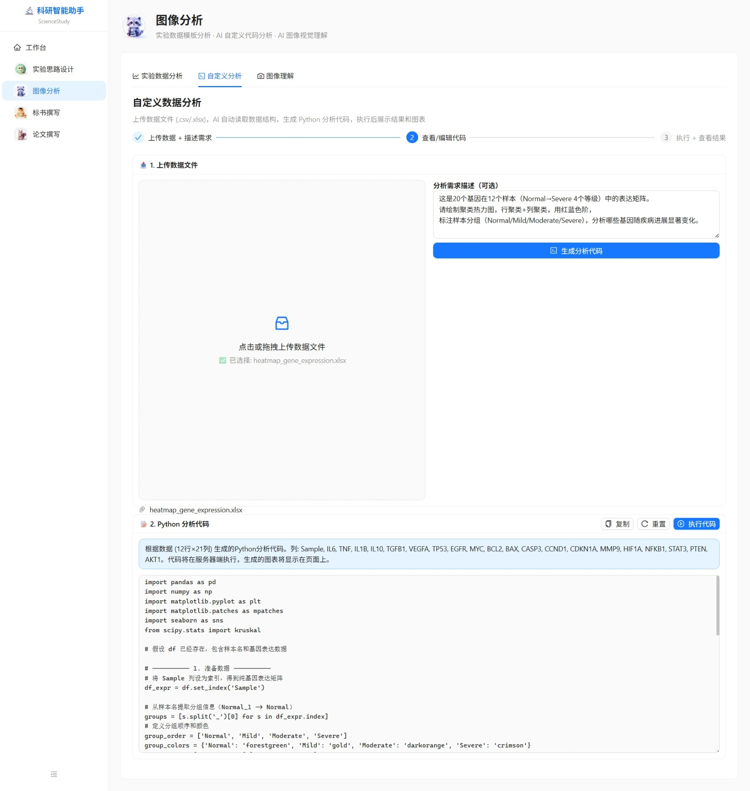
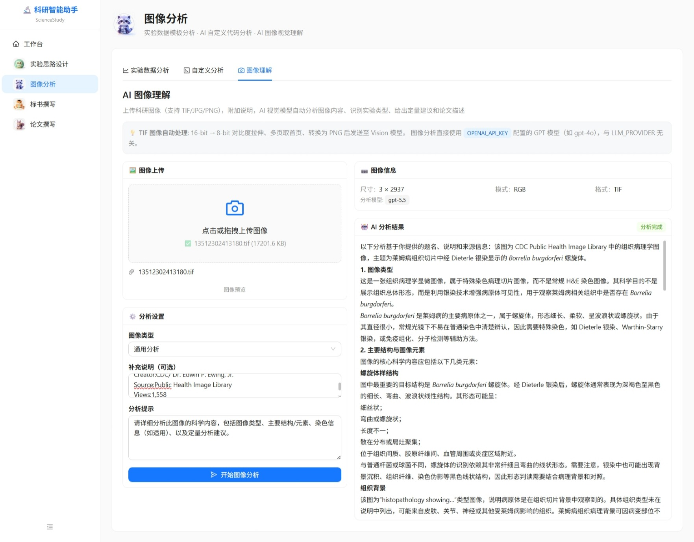

# ScienceStudy — 科研智能助手

AI 辅助生物医学研究一体化平台，覆盖 **实验设计 → 图像分析 → 标书撰写 → 论文撰写** 全流程。



## 四大模块

| 模块 | Agent | 功能 |
|------|-------|------|
|  **实验思路设计** | 猫头鹰·智多星 | 多源文献检索 → 知识库构建 → 智能检索 → 实验方案生成 |
|  **图像分析** | 浣熊·视觉专家 | 6 类实验模板分析 + AI 自定义代码分析 + AI 图像视觉理解 |
|  **标书撰写** | 仓鼠·架构师 | 国自然/省自然模板 + 技术路线图 + 机制图工具 |
|  **论文撰写** | 松鼠·翻译官 | IMRaD 结构化写作 + AI 润色 + 参考文献管理 |

---

## 功能预览

### 模块 1：实验思路设计

| 文献检索 | 知识库构建 |
|----------|-----------|
|  |  |

| 向量检索 | 实验方案生成 |
|---------|-------------|
|  |  |

- **多数据源检索**：PubMed / arXiv / bioRxiv，支持关键词组合
- **PDF 上传 + 自动解析**：提取全文文本，构建向量知识库（ChromaDB + 千问 Embedding）
- **混合检索**：语义检索 + BM25 关键词检索 + RRF 融合排序
- **实验方案生成**：DeepSeek 意图解析 → 知识库证据检索 → 结构化方案输出，每条建议精确引用文献

### 模块 2：图像分析

| 模板分析 CCK8 | 模板分析 EdU | 模板分析 WB |
|-------------|-------------|------------|
|  |  |  |

| 自定义分析 | AI 图像理解 |
|-----------|------------|
|  |  |

#### 子模块 2.1：模板数据分析
覆盖 **CCK8 / EdU / 克隆形成 / Western Blot / qPCR / IHC** 六大实验类型：
- 上传数据文件或图像 → 自动分析 → matplotlib 生成 SCI 级图表
- 支持剂量-效应曲线拟合 (4PL)、IC50 计算、ANOVA/t-test 统计
- 图表支持右键下载 PNG

#### 子模块 2.2：自定义数据分析
- 上传任意 CSV/Excel 数据 → AI 自动读取结构 → 生成完整 Python 分析代码
- 代码可编辑，支持热力图、聚类图、相关性矩阵、箱线图等
- 沙箱子进程安全执行，捕获 stdout + matplotlib 图表

#### 子模块 2.3：AI 图像理解
- 上传科研图像 (TIF/JPG/PNG) → GPT Vision 模型自动分析
- 支持显微镜图像、IHC、WB 条带等多种类型
- TIF 自动预处理：16-bit→8-bit 对比度拉伸、多页取首页

---

## 技术栈

| 组件 | 技术 |
|------|------|
| **前端** | React 19 + TypeScript + Ant Design 6 + ECharts + React Markdown |
| **后端** | Python FastAPI + uvicorn |
| **Embedding** | 千问 `text-embedding-v4` API（1024 维） |
| **LLM** | DeepSeek `deepseek-v4-pro` / GPT-4o / GPT-5.5（可切换） |
| **Vision** | GPT-5.5 API（图像理解） |
| **向量数据库** | ChromaDB（本地，CPU） |
| **关键词检索** | BM25 + jieba 分词（本地，CPU） |
| **图像处理** | OpenCV + scikit-image + matplotlib + seaborn |
| **PDF 解析** | PyMuPDF |
| **文献检索** | PubMed E-utilities + arXiv API + bioRxiv API |

---

## 快速开始

### 环境要求

- Python 3.9+
- Node.js 18+
- Windows / macOS / Linux

### 1. 安装依赖

```bash
# 后端
cd server
pip install -r requirements.txt

# 前端
cd web
npm install
```

### 2. 配置 API Key

```bash
cp .env.example .env
# 编辑 .env，填入你的 API Key：
#   - QWEN_API_KEY      千问 Embedding
#   - DEEPSEEK_API_KEY   DeepSeek LLM（实验方案生成）
#   - OPENAI_API_KEY     GPT Vision（图像理解）
```

### 3. 启动

```bash
# 后端（终端 1）
cd server
python -c "import uvicorn; uvicorn.run('main:app', host='127.0.0.1', port=8000)"

# 前端（终端 2）
cd web
npm run dev
```

打开 http://localhost:5173

---

## 项目结构

```
scienceStudy/
├── server/                          # Python FastAPI 后端
│   ├── main.py                      # 应用入口 + 全局 JSON 序列化
│   ├── config.py                    # 配置（从 .env 加载 LLM/Embedding）
│   ├── routers/
│   │   ├── literature.py            # 模块 1：文献检索/上传/知识库/方案
│   │   ├── image_analysis.py        # 模块 2：6 类实验 + 自定义 + 图像理解
│   │   ├── writing.py               # 模块 3/4：AI 写作
│   │   └── export.py                # 图表导出
│   └── services/
│       ├── knowledge_base.py        # ChromaDB + Embedding + BM25
│       ├── experiment_designer.py   # DeepSeek 实验方案生成
│       ├── chart_generator.py       # matplotlib SCI 图表生成
│       ├── code_executor.py         # 沙箱 Python 代码执行
│       ├── image_understanding.py   # GPT Vision 图像分析
│       ├── data_templates.py        # 6 类实验数据模板
│       ├── cck8_service.py          # CCK8 分析（4PL/IC50/ANOVA）
│       ├── edu_service.py           # EdU 分析（核分割/阳性判定）
│       ├── colony_service.py        # 克隆形成分析
│       ├── wb_service.py            # WB 条带定量
│       ├── qpcr_service.py          # qPCR ΔΔCt 分析
│       └── ihc_service.py           # IHC 颜色反卷积/H-Score
├── web/                             # React + TypeScript 前端
│   └── src/
│       ├── pages/
│       │   ├── ExperimentDesign/    # 模块 1：5 个 Tab
│       │   ├── ImageAnalysis/       # 模块 2：3 个子模块
│       │   │   ├── ExperimentAnalysis.tsx   # 6 类实验模板
│       │   │   ├── CustomAnalysis.tsx       # 自定义代码分析
│       │   │   └── ImageUnderstanding.tsx   # AI 图像理解
│       │   ├── GrantWriting/        # 模块 3
│       │   └── PaperWriting/        # 模块 4
│       └── services/
│           ├── module1.ts           # 模块 1 API
│           └── module2.ts           # 模块 2 API
├── testData/                        # 测试数据（6 类实验 + 热力图）
├── crawler/                         # 测试数据生成器
├── imgs/                            # 截图
└── .env.example                     # API Key 配置模板
```

---

## 已实现

- [x] 多数据源论文检索（PubMed / arXiv / bioRxiv）
- [x] PDF 上传 + 全文提取 + 知识库构建（ChromaDB + BM25）
- [x] 混合检索（语义 + 关键词 + RRF）+ 实验方案生成
- [x] **CCK8 剂量曲线 + IC50 + 统计分析**
- [x] **EdU 荧光图像细胞核分割 + 阳性率**
- [x] **克隆形成识别与计数**
- [x] **Western Blot 泳道/条带检测 + 灰度定量**
- [x] **qPCR ΔΔCt 计算 + 相对表达量**
- [x] **IHC 颜色反卷积 + H-Score**
- [x] **AI 自定义代码生成 + 沙箱执行**
- [x] **GPT Vision 图像理解（TIF 支持）**

## 待实现

- [ ] 标书撰写 + 技术路线图/机制图
- [ ] 论文结构化写作 + AI 润色
- [ ] PubMed 论文自动下载 PDF

## License

MIT
